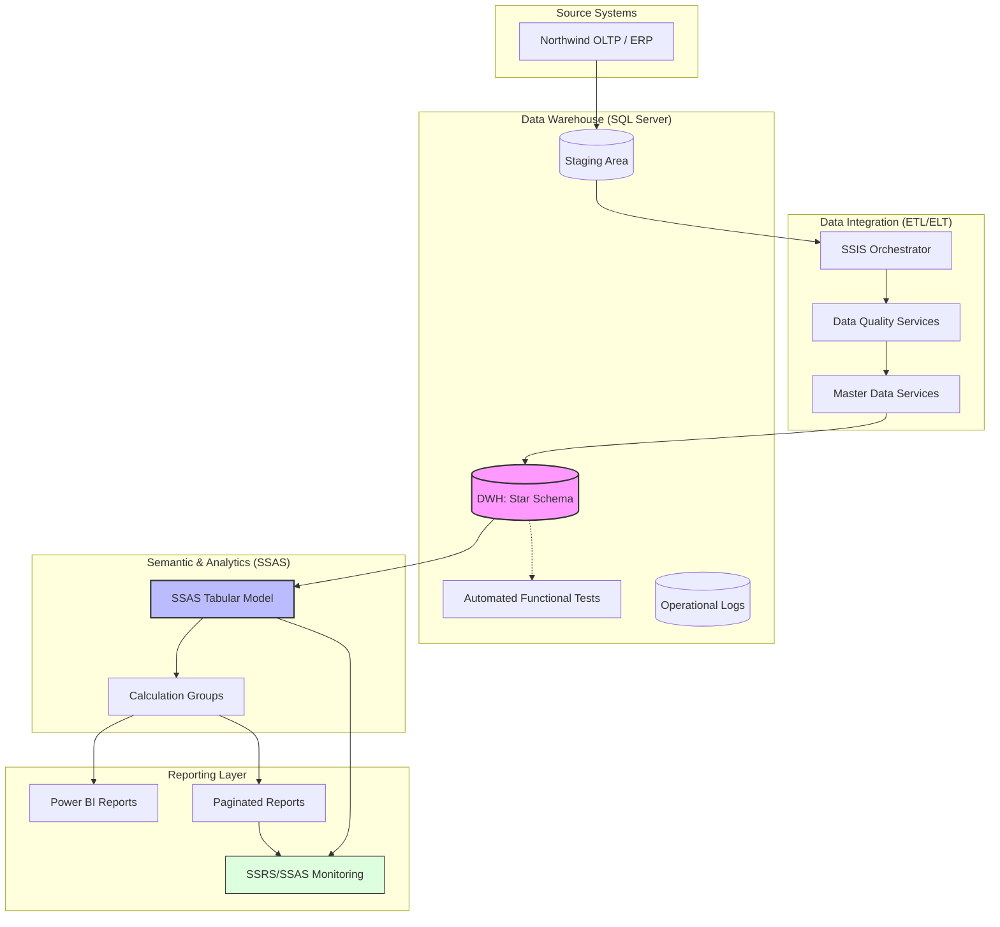

# 🏛️ Northwind BI Solution
**A production-grade, end-to-end Enterprise Business Intelligence ecosystem.**

---

### 💡 Why choose this solution?

Unlike typical "flat-file" BI projects, **Northwind BI Solution** is a professional framework designed for scalability, manageability, and data integrity. It bridges the gap between raw data and executive insights by implementing a full-stack Enterprise BI lifecycle.

*   **Architected for Growth:** Built with **Partitioning** and **Columnstore** technology to handle datasets that would crush a standard SQL Server instance.
*   **Engineered for Professionals:** Leverages **SSAS Tabular** and **Calculation Groups** (via Tabular Editor) to eliminate measure duplication and ensure a "Single Version of Truth."
*   **Ops-Ready from Day One:** Includes built-in **Monitoring** and **Master Data Management (MDS)**, transforming a simple database into a governed analytical platform.
*   **DevOps Centric:** Designed with environment isolation (Dev/Test/Prod) and CI/CD-ready structure for automated deployments via **Azure DevOps**.

> **This is not just a dashboard — it's a scalable blueprint for modern Enterprise Business Intelligence.**

---

### 📐 Architecture Overview

---

### 🛠️ Tech Stack & Tools

| Layer | Technologies |
| :--- | :--- |
| **Database & DWH** | `SQL Server 2022`, `T-SQL`, `Columnstore`, `Partitioning` |
| **ETL & Integration** | `SSIS (Integration Services)`, `ELT Patterns`, `Master Data Services (MDS)`, `Data Quality Services (DQS)` |
| **Semantic & Analytics**| `SSAS Tabular`, `DAX`, `Calculation Groups`, `Tabular Editor 2/3` |
| **Reporting** | `Power BI Report Server`, `Paginated Reports (SSRS)`, `Excel` |
| **DevOps & QA** | `Azure DevOps`, `CI/CD Pipelines`, `Automated Functional Testing` |

---

### 🚀 Key Features & Architectural Highlights

#### **1. High-Performance Data Engineering (Storage Layer)**
*   **Scalable Storage Architecture:** Physical and logical **partitioning** leveraging **Clustered Columnstore Indexes**, ensuring sub-second query performance on datasets ranging from hundreds of GBs to TBs.
*   **Automated Partition Management:** Fully implemented **Sliding Window** mechanism (automated Partition Merge/Split) to maintain consistent load performance and data retention policies.
*   **Hybrid ETL/ELT Strategy:** Optimized processing workflow where **SSIS** acts as an orchestrator, while heavy transformations are pushed down to the **T-SQL** engine (ELT) for maximum throughput.

#### **2. Enterprise Semantic Layer (Analytic Layer)**
*   **Advanced Tabular Modeling:** Centralized semantic layer based on **SSAS Tabular**, enforcing the "Single Version of Truth" principle across all reporting tools.
*   **Calculation Groups Mastery:** Advanced use of **Tabular Editor** to implement complex analytical scenarios (**Time Intelligence**, **ABC/XYZ Analysis**, **Dynamic Metric Selection**) while eliminating "Measure Explosion."
*   **Pro-level Analytics:** Pre-built templates for deep-dive analysis, including **Market Basket Analysis**, Customer Retention (New & Returning), and Spend-based Clustering.

#### **3. Data Governance & Operational Excellence (Management Layer)**
*   **Master Data & Quality (MDS/DQS):** Integrated Master Data Services and Data Quality Services for automated deduplication, cleansing, and Golden Record management.
*   **Comprehensive Monitoring Subsystem:** A unique **SSRS/SSAS Performance Audit** solution that tracks rendering times, report usage frequency, and query engine load in real-time.
*   **DevOps & CI/CD Ready:** Architecture designed for automated deployment via **Azure DevOps**, ensuring strict isolation between Dev/Test/Prod environments.

#### **4. Automated Quality Assurance (Testing Layer)**
*   **Functional ETL Testing:** Dedicated test database and stored procedure framework for automated **Data Quality Assurance (DQA)** at every stage of the pipeline.
*   **Data Integrity Validation:** Automated business logic checks, including duplicate detection, **Referential Integrity** verification, and schema consistency.
*   **Reconciliation & Regression:** Robust data reconciliation mechanisms between source systems and the Data Warehouse to guarantee 100% data accuracy.

#### **5. Reliability & Maintenance**
*   **Self-Healing Maintenance:** Automated maintenance plans for index optimization, statistics updates, and database integrity checks.
*   **Operational Logging:** Granular ETL execution logging with built-in error handling and alerting mechanisms.

---

### 📖 Documentation & Links
Detailed architectural decisions, schemas, and implementation guides are available here:
*   📄 [**Azure Repos (Main Doc)**](https://dev.azure.com/zinykov/NorthwindBI/_git/Northwind_BI_Solution?path=%2FDocs%2FNorthwind%20BI%20Solution.docx&version=GBmaster&_a=contents)
*   📄 [**GitHub Mirror**](https://github.com/zinykov/NorthwindBI/blob/master/Docs/Northwind%20BI%20Solution.docx)

---

### 🛡️ Project Badges & CI/CD Status

#### **Project Management**

#### **Deployment Status**

| CD: Databases | CD: SSIS | CD: Reports | CD: Functional ETL test |
| :--- | :--- | :--- | :--- |
|  |  |  |  |

---