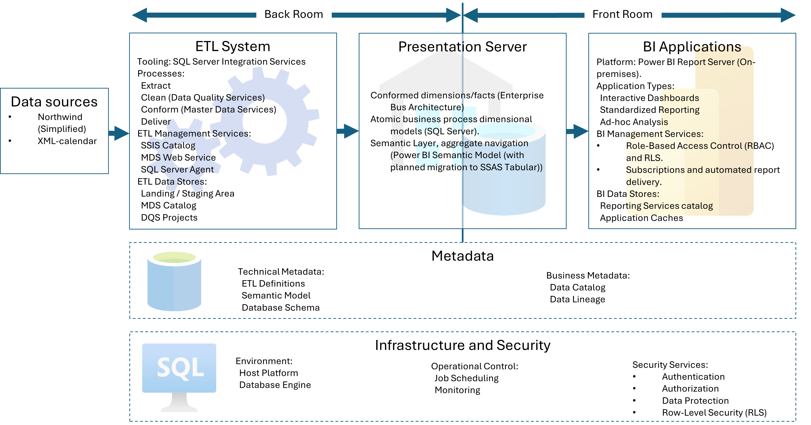
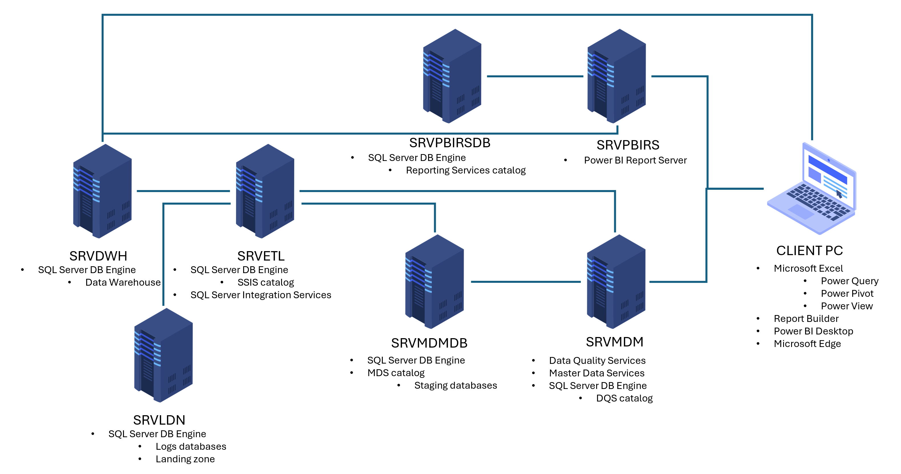
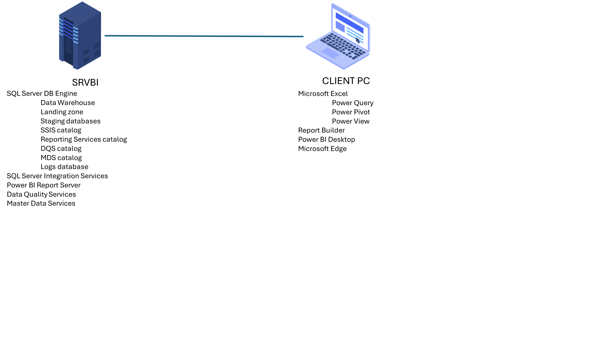
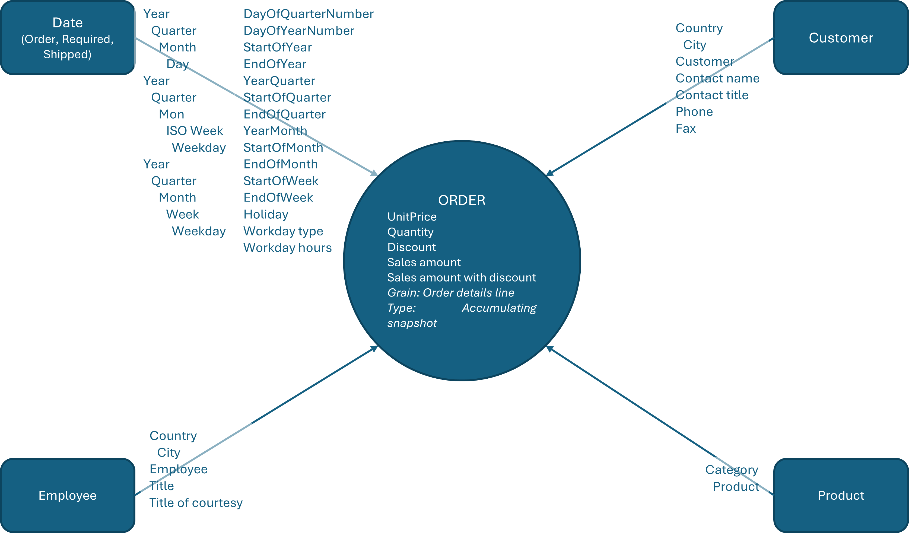
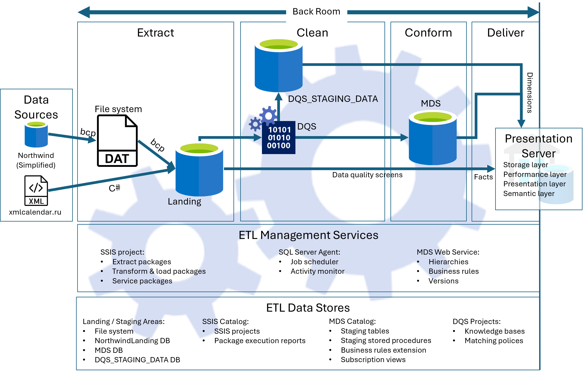

# 🏛️ Northwind Enterprise Data Platform (EDP)
**A production-grade, end-to-end Enterprise Business Intelligence ecosystem.**

---

## ✍️ About the Author
Architected and deployed a comprehensive Enterprise DWH/BI Platform by integrating disparate Microsoft stack components into a unified ecosystem. Focused on Full-cycle Automation (CI/CD, automated QA) and the practical application of Kimball Methodology to deliver high-integrity, scalable analytical solutions.

---

## 💡 Business Value & ROI

The Northwind Enterprise Data Platform (EDP) is designed to transform fragmented operational data into a high-integrity strategic asset. It moves the organization from "gut-feeling" management to a proactive, data-driven culture.

### 🛡️ 1. Data Trust & Governance (The "Single Source of Truth")
*   **Unified Analytical Hub (SSOT):** Eliminates data silos by consolidating Sales, Customers, and Products into a single source of truth. No more conflicting numbers across departments.
*   **Guaranteed Integrity:** Native integration of **Master Data Services (MDS)** and **Data Quality Services (DQS)** ensures that "noisy" operational data is cleansed and standardized before reaching decision-makers.
*   **End-to-End Traceability:** Full **Data Lineage** allows stakeholders to trace any KPI back to its source transaction, ensuring total transparency and auditability.

### ⚡ 2. Operational Excellence & Agility
*   **Accelerated Time-to-Insight:** Fully automated ETL pipelines eliminate manual report preparation. The business receives fresh analytics daily, not "on-demand" weeks later.
*   **Modular Scalability (Kimball Bus Architecture):** Built on the industry-standard **Bus Matrix**, the platform allows for seamless integration of new business processes (e.g., Inventory, Logistics) without refactoring the core architecture.
*   **Reduced TCO (Total Cost of Ownership):** Automated maintenance plans (intelligent indexing, partitioning, and backups) ensure peak performance with minimal administrative overhead.

### 📈 3. Strategic Edge & Growth Support
*   **Advanced Analytics Out-of-the-Box:** The dimensional model is pre-configured for high-value analysis, including **ABC Classification**, **Customer Segmentation**, and **Market Basket Analysis**.
*   **Future-Proof Open Architecture:** Decoupled storage and semantic layers allow the organization to swap or add BI tools (Power BI, Excel, SSRS) without reinvesting in the underlying data infrastructure.
*   **Enterprise-Grade Security:** Robust **RLS (Row-Level Security)** and **RBAC** frameworks ensure that sensitive business data is protected and accessible only to authorized roles.

---

## 📐 Architecture & Design

### High-Level System Architecture

*Full-stack BI lifecycle implementation from source to reporting layer.*

### Scalable Topology
The solution supports various deployment scenarios, from a single-server setup to a fully distributed enterprise cluster.

<b>View Enterprise Distributed Topology (Recommended)</b>

*Architecture designed for high availability and workload separation (Dedicated ETL, MDS, and Report Servers).*

<b>View Single-Server Setup (PoC)</b>

*Cost-effective deployment for small datasets, development, and automated functional testing.*

### Dimensional Model (DWH)

*Star schema design optimized for analytical query performance (Kimball Methodology).*

### ETL Design
The ETL architecture follows the classic **Kimball "Back Room"** pattern, organized into four distinct stages: **Extract, Clean, Conform, and Deliver**. The entire pipeline is managed by a centralized metadata-driven engine.

*   **Extract:** Multi-source ingestion using `bcp` for flat files (DAT) and C# components for external APIs (e.g., xmlcalendar.ru), landing data into the **NorthwindLanding** SQL database.
*   **Clean & Conform:** Seamless integration with **SQL Server Data Quality Services (DQS)** for automated cleansing and **Master Data Services (MDS)** for "Golden Record" consolidation and hierarchy management.
*   **Deliver:** Automated delivery of verified Dimensions and Facts to the **Presentation Server**, structured into Storage, Performance, and Semantic layers.
*   **Management Services:** Orchestration via **SQL Server Agent** with full observability through the **SSIS Catalog** (logging, lineage, and execution reports).

---

## 🛠️ Tech Stack & Tools

| Layer | Technologies |
| :--- | :--- |
| **Database & DWH** | `SQL Server 2022`, `T-SQL`, `Columnstore`, `Partitioning`, `File Groups` |
| **ETL & Integration** | `SSIS (Integration Services)`, `ELT Patterns`, `MDS`, `DQS`, `SHA2 Delta Capture` |
| **Semantic & Analytics**| `Kimball Bus Matrix`, `SSAS Tabular`, `DAX`, `Calculation Groups`, `Tabular Editor 2/3` |
| **Reporting** | `Power BI Report Server`, `Power BI Reports`, `SSAS`, `Paginated Reports (SSRS)`, `Excel` |
| **DevOps & QA** | `Azure DevOps`, `Azure Pipelines`, `MSTest`, `SQL Unit Testing` |

---

## 📂 Repository Structure & Solutions
The project is organized into dedicated Visual Studio Solutions to support both high-speed development and automated CI/CD pipelines:

### Primary Development
*   **`NorthwindBI.sln`** — **The main development entry point.** Contains the full modular architecture:
    *   `Data Engineering` — Databases & SSIS projects: Landing, Staging, DWH, Logs, ETL.
    *   `Data Analysis` — Power BI reports, SSRS projects and PBIRS branding files.
    *   `Tests` — Automated validation framework for ETL, Landing, DW and Logs.
    *   `Scripts` — External SQL/PS/cmd scripts for Maintenance, Security and SSIS configurations.
    *   `Docs` — Solution Architecture Document, Source to target mapping, DW hardware specs, Data Profiles, .

### CI/CD & Build Automation
The repository includes dedicated solutions to support complex build requirements across different environments:

*   **`NorthwindAzurePipelineBuild.sln`** — Optimized for **Cloud-native builds**. This solution contains projects fully supported by Azure DevOps hosted agents, enabling seamless cloud deployment pipelines.
*   **`NorthwindSWIFT3Build.sln`** — Designed for **Self-hosted build agents**. This configuration handles projects that require a specialized local environment or specific dependencies not available in the cloud, ensuring consistent builds for the entire platform.

---

## 🚀 Key Features & Architectural Highlights

### 1. End-to-End Automated Testing (Project Know-How)
**The primary technological advantage of this project.** A unique, custom automated testing framework is integrated directly into the DWH development lifecycle. 

*   **Star Schema Integrity:** Unlike generic data tests, this framework specifically validates the **Kimball Dimensional Model**. It automatically detects "orphaned" facts, ensures referential integrity between Dimensions and Facts, and verifies that SCD Type 2 logic correctly preserves historical accuracy.
*   **For Business:** Guarantees 100% data accuracy in reports. Data anomalies are localized at the earliest stages, completely eliminating the risk of making critical management decisions based on incorrect information.
*   **For IT:** Automated Unit Testing and business logic validation are executed "in one click," radically reducing time spent on regression testing, debugging, and system maintenance.

### 2. High-Performance Data Engineering (Scale-with-Business)
The architecture is designed on a "Scale-with-Business" principle: the DWH scales seamlessly alongside the company, supporting both vertical power scaling and horizontal distribution of services (SSIS, MDS, SSRS) across cluster nodes.
*   **Autonomous Storage:** Full database physics automation — the system independently manages filegroup creation on SSD/HDD based on data recency, configures compression (PAGE/COLUMNSTORE), and manages partition slicing via a "Sliding Window" strategy.
*   **ETL performance:** Dynamic creation and dropping of indexes and constraints in the Landing Zone (LZ) to ensure peak performance for both bulk inserts and delta selection.
*   **Shadow Loading:**  Implementation of the Switch Partition pattern and MERGE logic to ensure millions of rows are loaded without locking out business users, while maintaining correct handling of late-arriving data.
*   **Operational Automation:** Zero-routine maintenance via **Automated Maintenance Plans** — intelligent index maintenance, statistics updates, and full server backups (including system databases) run autonomously via SQL Agent scheduling.

### 3. Multi-level Data Quality Control
A comprehensive, multi-layered quality filter that ensures the purity and transparency of corporate information.
*   **Master Data & Cleansing:** Deep integration with **Master Data Services (MDS)** for "Golden Record" management and **Data Quality Services (DQS)** for automated attribute cleansing and enrichment.
*   **Deep Traceability:** **Lineage** technology and the hybrid **AllAttributes** field preserve a complete audit trail for every record, allowing the context of any transformation to be reconstructed directly within the semantic model.

### 4. Modern Developer Experience (DX)
Applying **Software Engineering** best practices to the data world for accelerated development and release stability.
*   **Engineering Culture:** Development via Database Projects (SSDT), full Git version control, isolated debugging environments, and a pre-configured **CI/CD pipeline**.
*   **Efficiency:** A single entry point for developers and "one-click" local test execution minimize the "human factor" during deployment and significantly reduce Time-to-Market.

---

## 📖 Documentation & Links
Detailed architectural decisions, schemas, and implementation guides are available here: [**Solution Architecture Document**](Docs/Solution%20Architecture%20Document.docx)

---

## 🚀 Getting Started

### Prerequisites
To develop and deploy the Northwind EDP, ensure the following are installed:
*   **SQL Server 2022** (with MDS, DQS, and Integration Services)
*   **Visual Studio 2022** + SQL Server Data Tools (SSDT)
*   **Power BI Report Server** (January 2026 or later)
*   **Power BI Desktop (RS version)**

### Deployment Workflow
1.  **Databases:** Open `NorthwindBI.sln` and configure the **Debug** settings for all database projects to point to your local instance.
2.  **Master Data:** Restore **MDS** and **DQS** using the backups in `/DQS` and `/MDS` folders.
3.  **Environment:** Open the /Test/.rensettings and update **Parameters** to match your environment.
4.  **Verification:** Execute the automated test suite via the **Test Explorer** in Visual Studio to verify the integrity of the deployed environment..

---

## 🗺️ Project Roadmap

The project is evolving from a local BI prototype to a distributed Enterprise Data Platform. Current development is focused on:

*   **[In Progress] Semantic Layer Migration:** Transitioning the data model from Power BI Desktop to a dedicated **SSAS Tabular** instance to support multiple reporting clients and centralized measure management.
*   **[In Progress] Advanced Metadata Catalog:** Implementation of a dedicated `Metadata` schema for automated **Lineage** tracking and a Business Glossary (Data Dictionary) in Azure Wiki.
*   **[Planned] Full E2E Test Coverage:** Extending the **MSTest framework** to include the **Extract** layer, ensuring robust data contracts and automated handling of source schema changes (Schema Drift).
*   **[Planned] Data Tiering (TCO Optimization):** Automated movement of historical data partitions between high-performance SSD and cost-effective HDD storage groups.

---

## 🛡️ Project Badges & CI/CD Status

### **Project Management**

### **Deployment Status**

| CD: Databases | CD: SSIS | CD: Reports | CD: Functional ETL test |
| :--- | :--- | :--- | :--- |
|  |  |  |  |

---